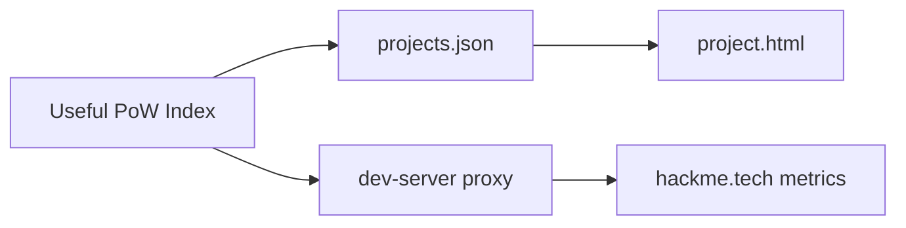

<div align="center">

<pre aria-label="HackMe Network ASCII logo">
██╗  ██╗ █████╗  █████╗ ██╗  ██╗███╗   ███╗███████╗    ███╗   ██╗███████╗████████╗██╗    ██╗ ██████╗ ██████╗ ██╗  ██╗
██║  ██║██╔══██╗██╔════╝██║ ██╔╝████╗ ████║██╔════╝    ████╗  ██║██╔════╝╚══██╔══╝██║    ██║██╔═══██╗██╔══██╗██║ ██╔╝
███████║███████║██║     █████╔╝ ██╔████╔██║█████╗      ██╔██╗ ██║█████╗     ██║   ██║ █╗ ██║██║   ██║██████╔╝█████╔╝
██╔══██║██╔══██║██║     ██╔═██╗ ██║╚██╔╝██║██╔══╝      ██║╚██╗██║██╔══╝     ██║   ██║███╗██║██║   ██║██╔══██╗██╔═██╗
██║  ██║██║  ██║╚██████╗██║  ██╗██║ ╚═╝ ██║███████╗    ██║ ╚████║███████╗   ██║   ╚███╔███╔╝╚██████╔╝██║  ██║██║  ██╗
╚═╝  ╚═╝╚═╝  ╚═╝ ╚═════╝╚═╝  ╚═╝╚═╝     ╚═╝╚══════╝    ╚═╝  ╚═══╝╚══════╝   ╚═╝    ╚══╝╚══╝  ╚═════╝ ╚═╝  ╚═╝╚═╝  ╚═╝
</pre>

# HackMe · Useful PoW Index

**Prototype** · curated registry of proof-of-work projects where hashrate does **verifiable useful work**

Not a profit board. Not a wallet. Not an exchange. A discovery module for the [HackMe](https://hackme.tech/) ecosystem.

<br/>

[](#)
[](https://hackme.tech/)
[](https://hackme.tech/pool/coordinator/api/pool/stats)
[](LICENSE)

<br/>

**[HackMe hub](https://hackme.tech/)** ·
**[Downloads](https://hackme.tech/downloads.html)** ·
**[Pool stats](https://hackme.tech/pool/coordinator/api/pool/stats)** ·
**[Main repo](https://github.com/jokeez/hackme)** ·
**[Docs](https://hackme.tech/docs.html)**

</div>

---

## What it is

| Lane | You get |
|------|---------|
| **Browse** | Curated `verified` / `watchlist` / `draft` listings |
| **Live stats** | Read-only adapters (HackMe via local proxy or same-origin on hub) |
| **Builders** | Get verified · metrics validator · compare · embed badge |
| **Submit** | JSON for **manual** review — not open spam registration |



---

## Status · prototype (not production)

| Area | State |
|------|--------|
| **UI shell** | Static HTML · HackMe visual language (IBM Plex / Space Grotesk · cyan/mint) |
| **Registry** | `assets/projects.json` · schema_version |
| **Live adapters** | HackMe pool metrics + work-stats |
| **Auth** | Local **mock** developer area only |
| **Deploy** | **Not** shipped on hackme.tech yet — local / future hub path |

**Honesty:** this is a **handoff prototype**. Prefer merging as a read-only module later; backend moderation can come without rewriting the UI.

---

## Quick start

```bash
python3 dev-server.py 8766
# open http://127.0.0.1:8766/
```

Dev server serves static files and proxies HackMe metrics:

| Path | Upstream |
|------|----------|
| `GET /proxy/hackme/metrics` | `https://hackme.tech/pool/api/global/metrics` |
| `GET /proxy/hackme/work-stats` | `https://hackme.tech/pool/coordinator/api/work/stats` |
| `GET /healthz` | liveness |

---

## Tests

```bash
BASE_URL=http://127.0.0.1:8766 bash tests/smoke.sh
node tests/test-core.mjs
node tests/test-i18n.mjs
node tests/test-registry.mjs
```

---

## Key pages

| Page | Role |
|------|------|
| `index.html` | Home — live pool chip, coins, submit JSON |
| `project.html?id=hackme` | Coin detail |
| `verified.html` | Adapter contract + metrics validator |
| `compare.html` | Side-by-side 2–3 projects |
| `status.html` | Ecosystem probes / adapter health |
| `docs.html` | Registry JSON + embed badge |
| `badge.html?id=hackme` | Standalone badge preview |
| `login.html` / `dashboard.html` | Mock developer area |

---

## Brand & license

- Visual identity aligned with [hackme.tech](https://hackme.tech/) (`#05070d`, `#4de4ff`, `#6effad`, logo-hex).
- License: **[AGPL-3.0](LICENSE)** (same family as the main HackMe repo).
- Brand use: **[TRADEMARK.md](TRADEMARK.md)** — do not impersonate the official pool or installers.
- Credits: **[NOTICE](NOTICE)**

---

## Related

| Repo / site | Role |
|-------------|------|
| [jokeez/hackme](https://github.com/jokeez/hackme) | Core network · pool · Dig/Hunt · paper exchange |
| [hackme.tech](https://hackme.tech/) | Public hub |
| [Chainquiry · HackMe Network](https://chainquiry.com/projects/hackme-network/) | Third-party directory card |
