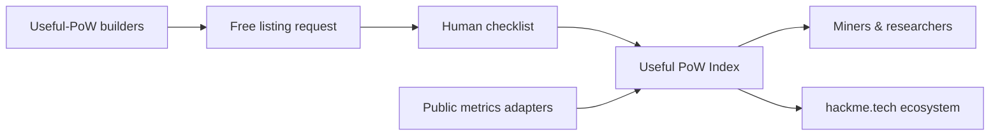
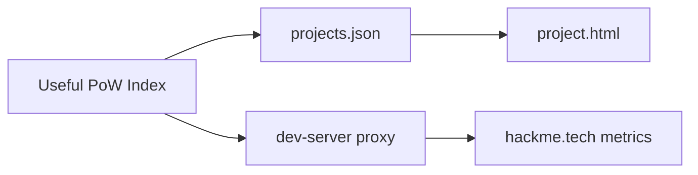

<div align="center">

<pre aria-label="HackMe App ASCII logo">
██╗  ██╗ █████╗  █████╗ ██╗  ██╗███╗   ███╗███████╗     █████╗ ██████╗ ██████╗ 
██║  ██║██╔══██╗██╔════╝██║ ██╔╝████╗ ████║██╔════╝    ██╔══██╗██╔══██╗██╔══██╗
███████║███████║██║     █████╔╝ ██╔████╔██║█████╗      ███████║██████╔╝██████╔╝
██╔══██║██╔══██║██║     ██╔═██╗ ██║╚██╔╝██║██╔══╝      ██╔══██║██╔═══╝ ██╔═══╝ 
██║  ██║██║  ██║╚██████╗██║  ██╗██║ ╚═╝ ██║███████╗    ██║  ██║██║     ██║     
╚═╝  ╚═╝╚═╝  ╚═╝ ╚═════╝╚═╝  ╚═╝╚═╝     ╚═╝╚══════╝    ╚═╝  ╚═╝╚═╝     ╚═╝     
</pre>

# HackMe App · Useful PoW Index

**Where useful mining gets discovered.**  
A curated registry of proof-of-work projects whose hashrate does **real, reviewable work** — not empty lottery hashing.

Not a profit board. Not a wallet. Not an exchange.  
A discovery surface for the [HackMe](https://hackme.tech/) ecosystem — and, over time, for **every honest useful-PoW project** that wants to be found.

<br/>

[](#status--open-prototype)
[](https://hackme.tech/)
[](LICENSE)
[](#roadmap--what-this-becomes)

<br/>

**[HackMe hub](https://hackme.tech/)** ·
**[Main network repo](https://github.com/jokeez/hackme)** ·
**[Pool stats](https://hackme.tech/pool/coordinator/api/pool/stats)** ·
**[Docs on hub](https://hackme.tech/docs.html)**

</div>

---

## Why this exists

Most “coin lists” optimize for volume, hype, or paid placement.  
**Useful PoW Index** optimizes for one question:

> Does hash power actually do something useful that a human can review?

Security fuzz. Scientific compute. Storage proofs. Research workloads.  
If the work is real and the metrics are public — it belongs here.

HackMe itself is the reference lane (WASM Dig / Hunt fuzz + useful GPU PoW).  
This app is the **index layer**: browse, compare, verify adapters, and — in the future — **list your useful project for free**.

---

## Vision · part of the HackMe ecosystem

| Today (this repo) | Tomorrow (ecosystem module) |
|-------------------|-----------------------------|
| Static prototype you can run locally | First-class surface on the HackMe hub |
| Hand-curated `projects.json` | Free public listing for useful-PoW builders |
| Read-only live adapters (HackMe first) | Pluggable adapters for any honest project |
| Manual JSON submit for review | Lightweight submit → human checklist → badge |
| Mock developer area | Real builder dashboard (watchlist, drafts, status) |

**The deal we want to keep:** listing stays **free**. No pay-to-rank. No “featured for $$$.”  
Visibility is earned by **useful work + public metrics + honest scope** — not by marketing budget.



---

## What you can do now

| Lane | You get |
|------|---------|
| **Browse** | Curated `verified` / `watchlist` / `draft` listings |
| **Live stats** | Read-only adapters (HackMe via local proxy or same-origin later on hub) |
| **Builders** | Get-verified flow · metrics validator · side-by-side compare · embed badge |
| **Submit** | JSON bundle for **manual** review — spam-resistant by design |



---

## Roadmap · what this becomes

No calendar promises — only direction:

1. **Stay honest** — prototype quality UI, clear “not production” labeling until hub ship
2. **Free listing rail** — builders submit useful coins/networks; operators review; index grows
3. **Adapter contract** — public metrics URL + honest scope checklist (already sketched in-app)
4. **Hub integration** — same visual language as [hackme.tech](https://hackme.tech/); read-only module first
5. **Badges & compare** — projects show verified status on their own sites; miners compare lanes
6. **Open contribution** — PRs welcome for registry entries, adapters, and docs once listing rules stabilize

If you are building useful PoW today: star the repo, open an issue with your project summary, or run the prototype and send a JSON submission locally. Early signal helps shape the free listing UX.

---

## Status · open prototype

| Area | State |
|------|--------|
| **UI shell** | Static HTML · English-only · HackMe visual language |
| **Registry** | `assets/projects.json` · versioned schema |
| **Live adapters** | HackMe pool metrics + work-stats |
| **Auth** | Local **mock** developer area (browser-only) |
| **Deploy** | **Not** on hackme.tech yet — run locally; hub path later |

**Honesty:** this is a **handoff / preview prototype**. The goal is to merge as a read-only ecosystem module without rewriting the UI. Backend moderation and free listing can land afterward.

---

## Quick start

```bash
git clone https://github.com/jokeez/hackme-app.git
cd hackme-app
python3 dev-server.py 8766
# open http://127.0.0.1:8766/
```

Dev server serves the static UI and proxies HackMe metrics:

| Path | Upstream |
|------|----------|
| `GET /proxy/hackme/metrics` | `https://hackme.tech/pool/api/global/metrics` |
| `GET /proxy/hackme/work-stats` | `https://hackme.tech/pool/coordinator/api/work/stats` |
| `GET /healthz` | liveness |

---

## Tests

```bash
python3 dev-server.py 8766
BASE_URL=http://127.0.0.1:8766 bash tests/smoke.sh
node tests/test-core.mjs
node tests/test-i18n.mjs
node tests/test-registry.mjs
```

---

## Key pages

| Page | Role |
|------|------|
| `index.html` | Home — live pool chip, coins, submit JSON |
| `project.html?id=hackme` | Project detail |
| `verified.html` | Adapter contract + metrics validator |
| `compare.html` | Side-by-side 2–3 projects |
| `status.html` | Ecosystem probes / adapter health |
| `docs.html` | Registry JSON + embed badge |
| `badge.html?id=hackme` | Standalone badge preview |
| `login.html` / `dashboard.html` | Mock developer area |

---

## Who this is for

| Audience | Why look here |
|----------|----------------|
| **Miners** | Find networks where GPU/CPU time does something useful |
| **Builders** | Get discovered without buying listing slots |
| **Researchers** | Compare useful-work claims with public adapters |
| **HackMe community** | See how index + pool + fuzz lanes fit together |

---

## Brand & license

- Visual identity aligned with [hackme.tech](https://hackme.tech/) (`#05070d`, `#4de4ff`, `#6effad`, logo-hex)
- UI copy is **English-only**
- License: **[AGPL-3.0](LICENSE)** (same family as the main HackMe repo)
- Brand use: **[TRADEMARK.md](TRADEMARK.md)** — do not impersonate the official pool or installers
- Credits: **[NOTICE](NOTICE)**

Built with care as a collaborator prototype for the HackMe ecosystem — open so the community can see the direction early.

---

## Related

| Repo / site | Role |
|-------------|------|
| [jokeez/hackme](https://github.com/jokeez/hackme) | Core network · pool · Dig/Hunt · paper exchange |
| [hackme.tech](https://hackme.tech/) | Public hub |
| [Chainquiry · HackMe Network](https://chainquiry.com/projects/hackme-network/) | Third-party directory card |

---

<div align="center">

**Useful work deserves to be findable.**  
Star · fork · open an issue · list your project when the free rail opens.

</div>
